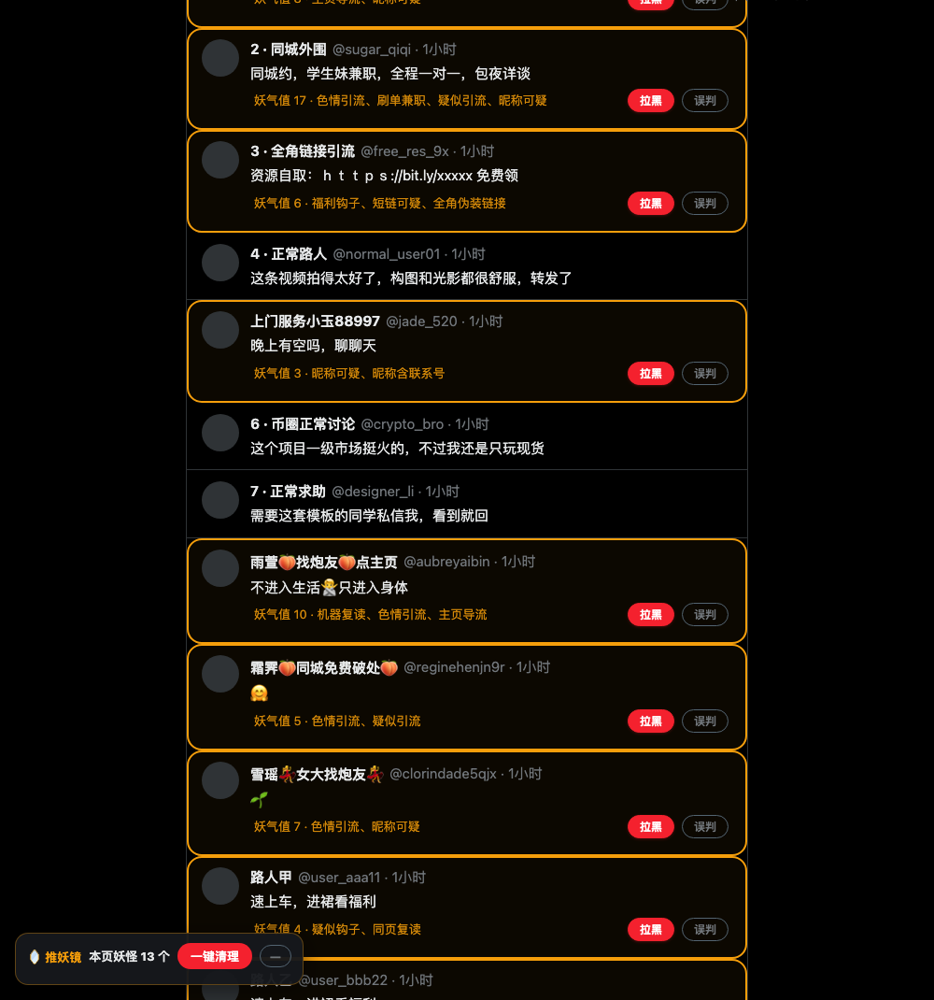

# 🪞 推妖镜 BotZapper

> 照妖镜一照,妖怪现形;你亲手一点,世界清静。

识别 X (Twitter) 评论区垃圾账号——黄推引流、钓鱼、兼职刷单、金融诈骗——黄色高亮标注,并提供**一键原生拉黑**的 Chrome 浏览器扩展。

    



*演示页为仓库内置的模拟页面(`test/fixture.html`),展示黄框标注、妖气值、命中原因与拉黑/误判按钮。*

## 为什么需要它

刷 X 评论区,十个"妹子"九个托:黄推引流、博彩钓鱼、兼职刷单、杀猪盘话术,还用全角字母、emoji 插空、繁体字、拼音谐音(`vx`、`薇信`)躲避关键词。平台不管,你手动举报拉黑又慢又累。

推妖镜做的事只有一件:**把妖怪标出来,让你亲手收掉**。识别全程在你浏览器本地完成,拉黑走 X 官方接口、用你自己的登录会话——服务端生效、全端同步,不是前端眼不见为净。

## 功能亮点

### 🔍 识别:评分制引擎,专门对抗伪装

- **本地评分引擎**:词库命中加权求和,总分过阈值才标黄。内置约 90 条规则**全文公开可查**,识别阶段**零网络请求**。
- **字符伪装全看穿**:全角字母(`ｖｘ`)、零宽字符、emoji 插空(`看.我.主.页`、`不进入生活🙅只进入身体`)、**繁体变体**(`約炮`→`约炮`,归一化层自动折叠)、**拼音谐音**(`vx`、`+v`、`薇信`、`薇芯`、`威芯`),一样现形。
- **同页复读检测**:多个账号在同页复读同一文本(≥3 次、≥8 字符)判定为机器刷评,作为组合信号参与评分。
- **三层词库合并**:自定义词 > 远程热更新词 > 内置词,同形覆盖不重复计分。
- **规则热更新**:配置远程词库 JSON 地址(GitHub Raw / jsDelivr),每日自动同步对抗黑产变种;远程词库只接受纯文本词条(不接受正则,防注入),结构经校验。参见 [rules/remote-rules.json](rules/remote-rules.json)。
- **规则试算器**:弹窗里粘贴任意评论文本,实时显示妖气值与命中明细(哪个词、什么权重、命中正文还是昵称),还能模拟同页复读信号——调词库不必回 X 页面反复试。

### ⚡ 收妖:一键原生拉黑

- **黄框标注**:命中评论黄框 + 妖气值 + 命中原因(如「主页导流、色情引流、同页复读」)。
- **单条拉黑 / 一键清理**:黄框内红色「拉黑」按钮;左下角徽章显示「本页妖怪 N 个」,支持一键清理整页。
- **原生拉黑**:调用 X 官方拉黑接口,服务端生效、全端同步。
- **撤销拉黑**:弹窗「最近拉黑」列表,误拉黑一键撤销(走同一限速队列,不占每日额度)。

### 🛡️ 防风控:慢即是快

- 拉黑请求全浏览器**串行队列**,相邻请求随机延迟 800–2000ms;
- HTTP 429 **立即熔断**,静默冷却 10 分钟后自动恢复;
- **每日限额**默认 50 次(弹窗可调),到量即停,防止手滑触发风控;
- 临时网络失败最多重试 3 次;浏览器中途重启后队列从磁盘恢复,不丢任务、不重复请求。

### ❤️ 防误伤:宁可漏掉两个,绝不错杀一个

- 当前登录用户强制豁免,永不给自己打框;
- 每条黄框都有显眼「误判」按钮,点击即恢复正常显示,账号进入**永久白名单**(弹窗可管理);
- 宽松 / 标准 / 严格三档灵敏度(默认标准:单词强信号或双中信号组合才标注,单个中信号永不触发)。

### 🔒 隐私:什么也不收集

无远端上报、无统计埋点、无账号体系,所有数据只存在你的浏览器本地。权限仅 `storage`、`alarms` 与 x.com 域名(逐条说明见下)。

## 安装(开发者模式)

1. 下载/克隆本仓库;
2. 打开 Chrome,访问 `chrome://extensions`;
3. 右上角打开「开发者模式」;
4. 点「加载已解压的扩展程序」,选择本仓库根目录(含 `manifest.json`);
5. 刷新 x.com,左下角出现「🪞 推妖镜」徽章即安装成功。

## 使用

- 可疑评论会被黄框标注,框内点红色「拉黑」= 调用官方接口原生拉黑该账号;
- 左下角徽章显示当前页面捕获数量,点「一键清理」批量拉黑全页妖怪;
- 点「误判」:立即恢复正常显示,该账号进入永久白名单;
- 想加自己的违规词:点工具栏推妖镜图标 → 「自定义违规词」→ 输入词语、选权重(强=单词即标黄 / 中=需组合 / 弱=辅助加权)→ 添加,立即生效;
- 想验证一个词的效果:弹窗「规则试算器」粘贴文本,实时看到评分与命中明细;
- 弹窗还有:总开关、灵敏度、今日额度(进度条)、累计收妖数、白名单管理、队列状态、最近拉黑撤销。

## 它是如何调用拉黑接口的?

拉黑请求由扩展的 service worker 从**你的浏览器、用你自己的登录会话**发出,语义完全等价于你本人在网页上点「拉黑」按钮——插件只是替你省了「三点菜单 → 拉黑 → 确认」的四步操作。频率上做了拟人化限速与熔断保护(见上),因此**不会**高频请求,也不会读取你的时间线数据。

## 权限说明(逐条)

| 权限 | 为什么需要 |
|------|-----------|
| `storage` | 在本地保存设置、白名单、已拉黑标记与队列,不存任何账号凭据以外的数据 |
| `alarms` | 定时唤醒 service worker:驱动拉黑队列节拍与每日规则热更新 |
| `x.com` / `twitter.com` 域名访问 | 在 x.com 页面注入识别 UI;从你的登录会话发起拉黑/撤销请求 |

无 tabs、无历史、无跨站追踪,识别阶段零网络请求。

## 开发

零依赖、无构建步骤,纯 Manifest V3 原生 JS。

```
node --test "tests/*.test.mjs"   # 单元测试(50 例:识别引擎 + 队列决策)
python3 scripts/gen-icons.py     # 重新生成图标(需 Pillow)
```

打开 `test/fixture.html`(模拟 X DOM + chrome API mock)可在不登录 X 的情况下调试识别与 UI 全流程;`test/fixture.html?autoblock=1` 自动演示拉黑状态流转,`?clobber=1` 模拟 React 重渲染覆写样式的回归场景。

```
src/
├── core/          # 纯函数核心(浏览器/Node 共用,单测覆盖)
│   ├── normalize.js   # 全角/零宽/emoji/插空/繁简归一化
│   ├── rules.js       # 内置词库 + 远程词库校验(全文公开)
│   ├── detector.js    # 评分引擎(内置词 + 远程词 + 自定义词合并)
│   ├── queue-policy.js # 拉黑队列决策(熔断/限额/恢复,纯函数)
│   ├── auth.js        # 会话凭据与响应映射
│   └── storage.js     # chrome.storage 封装
├── content/       # 内容脚本
│   ├── ui.js          # 高亮/按钮/浮动徽章
│   └── main.js        # DOM 监听、复读聚类、指纹短路缓存
├── background/    # service worker:串行拉黑/撤销队列 + 规则热更新
└── popup/         # 设置面板 + 规则试算器
rules/
└── remote-rules.json  # 远程词库发布源(推到 GitHub 后在弹窗里填地址启用热更新)
```

## 免责声明

本项目与 X/Twitter 无任何关联。识别结果仅为启发式提示,拉黑动作由用户手动确认执行。请理性治理评论区,尊重其他用户。

---

MIT License
